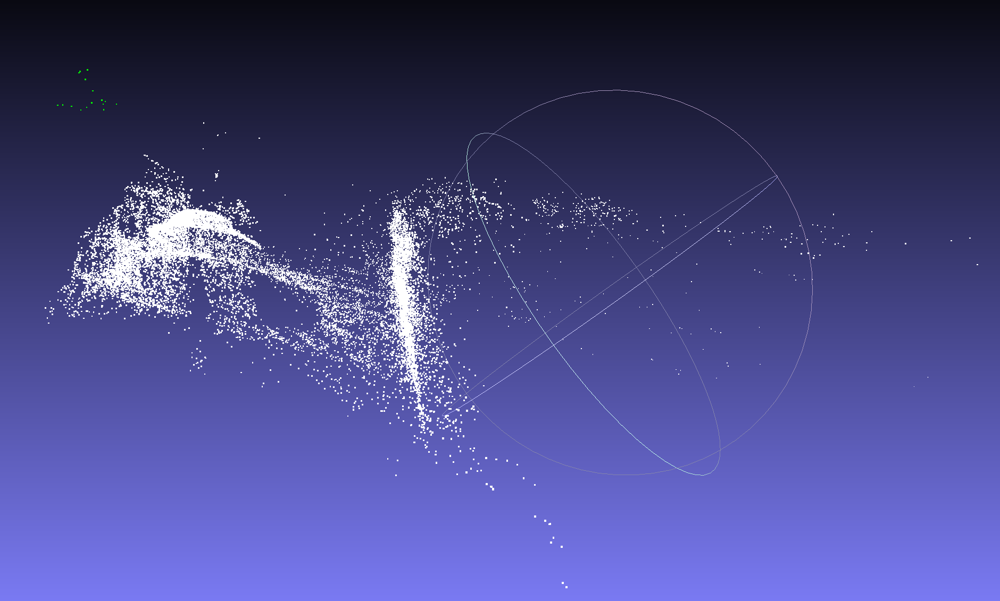
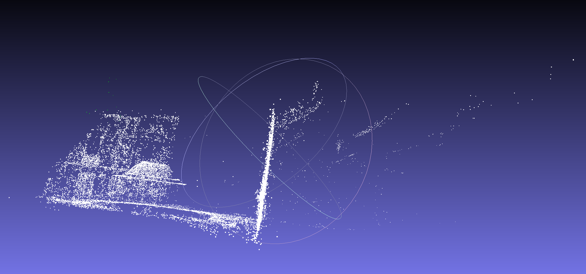

# BoundleAdjustment No Ceres OR G2O
Implement the BA use levenberg-marquardt method. Different with Ceres, this project use the block struct to make the compute sparse. At the same time, we used the bal data set for optimization testing, the effect is as follows.

## achieve effect

- before optimization



- after optimization



## ceres automatic derivation
At the same time, in terms of implementation, we did not use a third-party library, but implemented an automatic derivation method similar to ceres, which is also a good project for learning BA. The core part of the implementation is to overload the operator of the jet structure, so that the two data parts represent the function value and the derivative of the current point respectively, so as to realize automatic derivation.

## PNP solver using the automatic derivation
We also generated some corresponding data of 2D and 3D points in the data directory, and used these data to calculate the current camera pose with automatic derivation. Realize PNP settlement through BA.
- The output of the BA
```shell
-0.122376       -0.00560114     0.0614446
rotation:
  0.997938 -0.0524888  0.0369428
 0.0515346   0.998324  0.0263246
-0.0382626 -0.0243665   0.998971
```

- The result of ceres

```shell
T = 
   0.997866  -0.0516725   0.0399127   -0.127226
  0.0505959     0.99834   0.0275273 -0.00750673
 -0.0412689  -0.0254492    0.998824   0.0613861
          0           0           0           1
```

## Reference
- [http://ceres-solver.org/](http://ceres-solver.org/)
- [https://grail.cs.washington.edu/projects/bal/](https://grail.cs.washington.edu/projects/bal/)
- [https://github.com/starcosmos1225/BoundleAdjustment](https://github.com/starcosmos1225/BoundleAdjustment)
